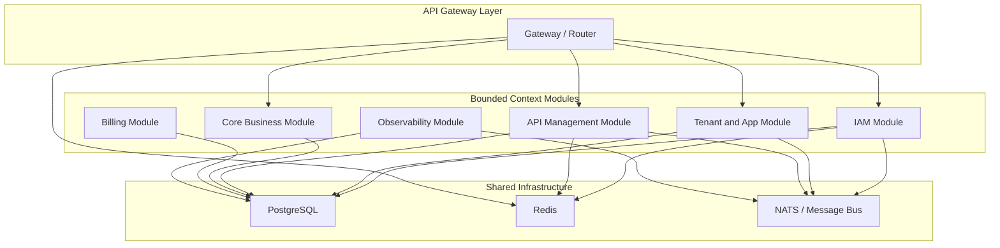

# masterfabric-go Implementation Plan

This plan implements the architecture described in [go_prompt.md](go_prompt.md) as a **Phase 1 modular monolith** -- a single Go binary with clearly separated bounded contexts, ready for future service extraction.

---

## Architecture Overview




---

## 1. Project Bootstrap

Initialize the Go module and foundational project structure.

- **Go module:** `github.com/masterfabric-go/masterfabric` (or the org's preferred path)
- **Go version:** 1.22+
- **Root files:** `go.mod`, `.gitignore`, `Makefile`, `Dockerfile`, `docker-compose.yml`, `README.md`

### Directory Structure

```
masterfabric_go/
  cmd/
    server/
      main.go                  # Single binary entry point
  internal/
    shared/                    # Cross-cutting shared kernel
      config/                  # Config loading (env, YAML)
      middleware/              # HTTP middleware (auth, RBAC, tenant, logging, rate limit)
      errors/                  # Domain error types
      events/                  # Event bus interface + in-process implementation
      logger/                  # Structured logging (slog)
      database/               # DB connection pool, migrations runner
      cache/                   # Redis client wrapper
      telemetry/              # OpenTelemetry setup
      pagination/             # Pagination helpers
      validator/              # Request validation helpers
    domain/
      iam/                     # Identity and Access Management context
        model/                 # User, Role, Permission, OrganizationUser entities
        service/               # RBACService, AuthService domain services
        event/                 # UserInvited, RoleAssigned domain events
        repository/            # Repository interfaces
      tenant/                  # Tenant and App Management context
        model/                 # Organization, App, AppApiKey entities
        service/               # TenantService domain services
        event/                 # AppCreated, OrgUpdated domain events
        repository/
      apimanagement/           # API Management context
        model/                 # Endpoint, EndpointPolicy entities
        service/               # EndpointService, PolicyService
        event/                 # EndpointUpdated, EndpointRetired
        repository/
      audit/                   # Observability and Audit context
        model/                 # AuditLog entity
        service/
        repository/
    application/
      iam/
        usecase/               # CreateUser, AssignRole, CheckPermission, Login
        dto/                   # Request/Response DTOs
      tenant/
        usecase/               # CreateOrg, CreateApp, ManageApiKeys
        dto/
      apimanagement/
        usecase/               # DefineEndpoint, UpdatePolicy, RetireEndpoint
        dto/
      audit/
        usecase/               # RecordAuditEvent, QueryAuditLogs
        dto/
    infrastructure/
      postgres/
        migrations/            # SQL migration files
        iam/                   # IAM repository implementations
        tenant/                # Tenant repository implementations
        apimanagement/         # API Management repository implementations
        audit/                 # Audit repository implementations
      redis/                   # Redis cache implementations
      nats/                    # NATS event bus implementation (or in-process for Phase 1)
      http/
        router/                # Chi/Echo router setup
        handler/
          iam/                 # IAM HTTP handlers
          tenant/              # Tenant HTTP handlers
          apimanagement/       # API Mgmt HTTP handlers
          audit/               # Audit HTTP handlers
          health/              # Health check handler
    gateway/                   # Gateway policy pipeline
      pipeline.go              # Middleware chain: tenant resolution, auth, RBAC, rate limit, audit
      resolver.go              # Tenant + App + Endpoint resolution
  pkg/                         # Public shared utilities (if needed)
  scripts/                     # Helper scripts (DB seed, migration runner)
  deployments/                 # Docker, K8s manifests
    docker-compose.yml
    Dockerfile
```

---

## 2. Technology Choices


| Concern          | Choice                                               | Rationale                                   |
| ---------------- | ---------------------------------------------------- | ------------------------------------------- |
| HTTP Router      | `chi` (github.com/go-chi/chi/v5)                     | Lightweight, idiomatic, middleware-friendly |
| Database         | `pgx` (github.com/jackc/pgx/v5)                      | High-performance PostgreSQL driver          |
| Migrations       | `goose` (github.com/pressly/goose/v3)                | Simple, SQL-based migrations                |
| Cache            | `go-redis` (github.com/redis/go-redis/v9)            | Standard Redis client                       |
| Config           | `viper` or `env`                                     | Environment-based config                    |
| Logging          | `slog` (stdlib)                                      | Structured JSON logging, zero dependency    |
| Validation       | `validator` (github.com/go-playground/validator/v10) | Struct tag validation                       |
| Auth/JWT         | `golang-jwt` (github.com/golang-jwt/jwt/v5)          | JWT parsing and validation                  |
| Telemetry        | `go.opentelemetry.io/otel`                           | OpenTelemetry traces + metrics              |
| Testing          | `testify` + `testcontainers-go`                      | Assertions + integration test containers    |
| Password hashing | `golang.org/x/crypto/bcrypt`                         | Secure password hashing                     |
| UUID             | `github.com/google/uuid`                             | UUID generation                             |


---

## 3. Implementation Order

The implementation follows a dependency-driven order: foundational pieces first, then contexts that depend on them.

### Phase 1A -- Foundation (Todos 1-4)

Shared kernel, config, database, logging, project skeleton.

### Phase 1B -- IAM Context (Todos 5-7)

Users, roles, permissions, authentication, RBAC enforcement middleware.

### Phase 1C -- Tenant and App Context (Todos 8-9)

Organizations, Apps, API keys, tenant resolution middleware.

### Phase 1D -- API Management Context (Todos 10-11)

Endpoints, policies, gateway pipeline.

### Phase 1E -- Observability and Audit (Todo 12)

Audit logging, structured logs, health checks.

### Phase 1F -- Integration and Hardening (Todos 13-14)

Docker Compose stack, integration tests, Makefile, documentation.

---

## 4. Key Design Decisions

- **Clean architecture boundaries:** Domain layer has zero external dependencies. Repository interfaces live in `domain/*/repository/`, implementations in `infrastructure/postgres/*/`.
- **Dependency injection:** Manual constructor injection via a `wire`-style bootstrap in `main.go`. No DI framework.
- **Multi-tenancy:** Every query includes `organization_id` filter. Middleware extracts tenant from JWT or API key and injects into context.
- **RBAC:** Permissions cached in Redis (`user:{id}:org:{id}:permissions`). Gateway middleware checks permission before handler executes.
- **Event bus:** Phase 1 uses an in-process event bus (channel-based). Interface allows swapping to NATS/Kafka in Phase 2.
- **Migrations:** SQL files in `infrastructure/postgres/migrations/`, run via goose at startup or CLI.
- **Error handling:** Domain-specific error types in `shared/errors/` with proper HTTP status mapping in handlers.

