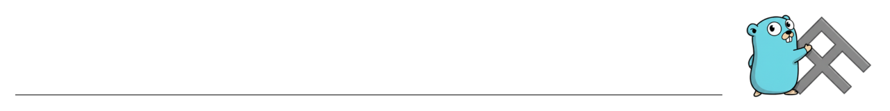

# masterfabric-go

<div align="center">




**Enterprise-grade, multi-tenant, RBAC-driven SaaS backend platform built with Go and clean/hexagonal architecture.**

[🚀 Quick Start](#quick-start) • [📚 Documentation](#architecture) • [🤝 Contributing](CONTRIBUTING.md) • [📄 License](LICENSE)

</div>

---

## Architecture

- **Domain-Driven Design** with bounded contexts (IAM, Tenant, API Management, Audit)
- **Clean Architecture**: domain layer has zero external dependencies
- **Phase 1 Modular Monolith**: single binary, ready for service extraction

## Tech Stack

| Component | Technology |
|-----------|-----------|
| Language | Go 1.22+ |
| HTTP Router | Chi |
| Database | PostgreSQL 16 (via pgx) |
| Cache | Redis 7 |
| Message Queue | Apache Kafka (via segmentio/kafka-go) |
| Migrations | goose |
| Auth | JWT (golang-jwt) + bcrypt |
| Observability | OpenTelemetry + Prometheus |
| Logging | slog (structured JSON) |
| Validation | go-playground/validator |

## Quick Start

### Prerequisites

- Go 1.22+
- Docker & Docker Compose
- (Optional) `goose` CLI for manual migration management

### Option 1: Development Mode (Recommended)

Use the `dev.sh` script for hot-reload development:

```bash
# Full startup: infrastructure + migrations + hot-reload server
./dev.sh

# Or step-by-step:
./dev.sh infra      # Start Docker services + run migrations
./dev.sh server     # Start hot-reload server (infra must be running)
```

The `dev.sh` script:
- ✅ Starts Docker services (Postgres, Redis, Kafka, Kafka UI)
- ✅ Waits for services to become healthy
- ✅ Runs database migrations automatically
- ✅ Starts the server with **hot-reload** (auto-restarts on file changes)
- ✅ Auto-installs `air` (hot-reload tool) if needed

**Hot-reload**: Edit any `.go` file and save — the server automatically rebuilds and restarts (~3s).

### Option 2: Manual Setup

```bash
# 1. Start infrastructure
make docker-up

# 2. Run migrations
make migrate

# 3. Run server
make run
```

The server starts on `http://localhost:8080`.

### Verify

```bash
curl http://localhost:8080/health/live
# {"status":"alive"}

curl http://localhost:8080/health/ready
# {"status":"ready","services":{"postgres":"healthy","redis":"healthy"}}
```

### Development Scripts

```bash
./dev.sh            # Full startup (infra + migrations + hot-reload)
./dev.sh server     # Hot-reload server only (skip infra)
./dev.sh infra      # Start infrastructure only
./dev.sh migrate    # Run migrations only
./dev.sh down       # Stop all Docker services
./dev.sh logs       # Tail Docker service logs
./dev.sh clean      # Stop infra, remove volumes, clean artifacts
./dev.sh help       # Show help
```

## API Endpoints

### Auth (public)
- `POST /api/v1/auth/register` - Register a new user
- `POST /api/v1/auth/login` - Login and receive JWT

### Users (authenticated)
- `GET /api/v1/me` - Get current user
- `GET /api/v1/users` - List users (paginated)
- `GET /api/v1/users/{id}` - Get user by ID
- `POST /api/v1/roles/assign` - Assign role to user

### Organizations (authenticated)
- `POST /api/v1/organizations` - Create organization
- `GET /api/v1/organizations` - List organizations
- `GET /api/v1/organizations/{orgId}` - Get organization

### Apps (authenticated)
- `POST /api/v1/organizations/{orgId}/apps` - Create app
- `GET /api/v1/organizations/{orgId}/apps` - List apps
- `GET /api/v1/organizations/{orgId}/apps/{appId}` - Get app

### API Keys (authenticated)
- `POST /api/v1/organizations/{orgId}/apps/{appId}/keys` - Create API key
- `GET /api/v1/organizations/{orgId}/apps/{appId}/keys` - List API keys
- `DELETE /api/v1/organizations/{orgId}/apps/{appId}/keys/{keyId}` - Revoke key

### Endpoints (authenticated)
- `POST /api/v1/organizations/{orgId}/apps/{appId}/endpoints` - Define endpoint
- `GET /api/v1/organizations/{orgId}/apps/{appId}/endpoints` - List endpoints
- `GET /api/v1/organizations/{orgId}/apps/{appId}/endpoints/{endpointId}` - Get endpoint
- `POST /api/v1/organizations/{orgId}/apps/{appId}/endpoints/{endpointId}/retire` - Retire endpoint
- `PUT /api/v1/organizations/{orgId}/apps/{appId}/endpoints/{endpointId}/policy` - Update policy
- `GET /api/v1/organizations/{orgId}/apps/{appId}/endpoints/{endpointId}/policy` - Get policy

### Audit Logs (authenticated)
- `GET /api/v1/organizations/{orgId}/audit-logs` - Org audit logs
- `GET /api/v1/users/{userId}/audit-logs` - User audit logs

### Observability
- `GET /health/live` - Liveness probe
- `GET /health/ready` - Readiness probe
- `GET /metrics` - Prometheus metrics

## Postman Collection

A complete Postman collection with **37 requests** and **auto-capturing scripts** is available:

- **Collection**: `postman/masterfabric-go.postman_collection.json`
- **Environment**: `postman/masterfabric-go-local.postman_environment.json`

### Features

- ✅ **Auto-capture JWT token** from Login → automatically used in all subsequent requests
- ✅ **Auto-capture IDs**: `user_id`, `org_id`, `app_id`, `endpoint_id`, `api_key_id` from responses
- ✅ **Variables persist** across sessions (saved to environment)
- ✅ **Test assertions** on every request (status codes, response validation)
- ✅ **Negative test cases** (unauthorized, validation errors, not found)

### Usage

1. Import both files into Postman
2. Select the **"MasterFabric Go - Local"** environment
3. Run **Login** → token is automatically saved
4. Run **Create Organization** → `org_id` is auto-captured
5. Run **Create App** → `app_id` is auto-captured
6. All subsequent requests use the captured variables automatically

**Endpoints covered**: Health, Auth, Users, Organizations, Apps, API Keys, Endpoints, Policies, RBAC, Audit Logs, Error Scenarios, **Invoke Defined Endpoints**.

### How to Use Defined Endpoints

After defining an endpoint (e.g., `POST /orders` or `GET /products`), you can invoke it through the API gateway:

**Required Headers:**
- `X-App-ID`: Your application ID (triggers gateway pipeline)
- `X-Organization-ID`: Your organization ID
- `Authorization: Bearer <jwt_token>`: JWT token for authenticated requests

**Example: Invoke GET /products**
```http
GET /api/v1/products
Headers:
  X-App-ID: <your-app-id>
  X-Organization-ID: <your-org-id>
  Authorization: Bearer <jwt-token>
```

**Example: Invoke POST /orders**
```http
POST /api/v1/orders
Headers:
  X-App-ID: <your-app-id>
  X-Organization-ID: <your-org-id>
  Authorization: Bearer <jwt-token>
  Content-Type: application/json
Body:
  {
    "product_id": "prod-123",
    "quantity": 2
  }
```

**Gateway Pipeline Flow:**
1. Gateway checks `X-App-ID` header
2. Looks up endpoint by method + path
3. Validates JSON schema (if defined)
4. Checks RBAC permissions (if policy requires)
5. Enforces rate limits
6. Applies interceptors (PII masking, transformations)
7. Routes to backend service

See the **"Invoke Defined Endpoints"** section in the Postman collection for complete examples including error scenarios.

## Configuration

All configuration is via environment variables with sensible defaults:

| Variable | Default | Description |
|----------|---------|-------------|
| `SERVER_HOST` | `0.0.0.0` | Bind host |
| `SERVER_PORT` | `8080` | Bind port |
| `DB_HOST` | `localhost` | PostgreSQL host |
| `DB_PORT` | `5432` | PostgreSQL port |
| `DB_USER` | `masterfabric` | PostgreSQL user |
| `DB_PASSWORD` | `masterfabric` | PostgreSQL password |
| `DB_NAME` | `masterfabric` | PostgreSQL database |
| `DB_SSLMODE` | `disable` | PostgreSQL SSL mode |
| `REDIS_HOST` | `localhost` | Redis host |
| `REDIS_PORT` | `6379` | Redis port |
| `KAFKA_ENABLED` | `false` | Enable Kafka event bus |
| `KAFKA_BROKERS` | `localhost:9092` | Kafka broker addresses (comma-separated) |
| `KAFKA_GROUP_ID` | `masterfabric-go` | Kafka consumer group ID |
| `KAFKA_NUM_PARTITIONS` | `3` | Default partitions for auto-created topics |
| `KAFKA_REPLICATION_FACTOR` | `1` | Replication factor for auto-created topics |
| `JWT_SECRET` | `change-me-in-production` | JWT signing secret |
| `JWT_EXPIRATION_HOURS` | `24` | JWT token lifetime |
| `LOG_LEVEL` | `info` | Log level (debug, info, warn, error) |
| `LOG_FORMAT` | `json` | Log format (json, text) |

## Kafka Event Bus

The project uses an `EventBus` interface (`internal/shared/events/bus.go`) that supports two implementations:

- **In-process bus** (default): channel-based, suitable for local dev and single-instance deployments
- **Kafka bus**: production-grade, uses `segmentio/kafka-go` with KRaft-mode Kafka (no Zookeeper)

### Enable Kafka

```bash
# Start infrastructure including Kafka
make docker-up

# Run with Kafka enabled
KAFKA_ENABLED=true make run
```

Kafka UI is available at `http://localhost:8090` for inspecting topics and messages.

### Topics

| Topic | Bounded Context | Events |
|-------|----------------|--------|
| `masterfabric.iam` | IAM | user.registered, user.invited, role.assigned, role.revoked |
| `masterfabric.tenant` | Tenant | organization.created, app.created, app.updated |
| `masterfabric.api-management` | API Management | endpoint.created, endpoint.updated, endpoint.retired |
| `masterfabric.audit` | Audit | (consumers write to audit_logs table) |

Topics are auto-created at startup when `KAFKA_ENABLED=true`.

### Publishing Events from Use Cases

**✅ Events are automatically published** from the following use cases:

- `RegisterUseCase` → `user.registered` (TopicIAM)
- `AssignRoleUseCase` → `role.assigned` (TopicIAM)
- `CreateOrgUseCase` → `organization.created` (TopicTenant)
- `CreateAppUseCase` → `app.created` (TopicTenant)
- `DefineEndpointUseCase` → `endpoint.created` (TopicAPIManagement)
- `RetireEndpointUseCase` → `endpoint.retired` (TopicAPIManagement)

The `EventBus` is injected into use cases at startup. Events are automatically serialized into JSON envelopes with metadata (ID, type, source, timestamp).

**Example**: When you create an organization via `POST /api/v1/organizations`, the `organization.created` event is published to Kafka topic `masterfabric.tenant`.

**Verify events**: Use Kafka UI at `http://localhost:8090` or consume directly:

```bash
docker exec masterfabric-kafka /opt/kafka/bin/kafka-console-consumer.sh \
  --bootstrap-server localhost:29092 \
  --topic masterfabric.tenant \
  --from-beginning
```

### Consuming Events

Register handlers at startup in `main.go`:

```go
eventBus.Subscribe(events.TopicIAM, func(ctx context.Context, event events.Event) error {
    log.Info("iam event", "event", event)
    return nil
})
```

## Project Structure

```
cmd/server/             - Application entry point
internal/
  shared/               - Cross-cutting concerns (config, middleware, errors, events)
  domain/               - Domain layer (entities, interfaces, domain events)
    iam/                - Identity & Access Management
    tenant/             - Tenant & App Management
    apimanagement/      - API Management
    audit/              - Audit & Observability
  application/          - Use cases and DTOs
  infrastructure/       - External implementations (postgres, redis, http)
  gateway/              - API Gateway policy pipeline
deployments/            - Docker and deployment configs
```

## Scripts

The `scripts/` directory contains utility scripts for common development tasks:

### Database Scripts

```bash
# Run migrations
./scripts/migrate.sh up          # Apply all pending migrations
./scripts/migrate.sh down         # Rollback last migration
./scripts/migrate.sh status       # Show migration status
./scripts/migrate.sh create NAME  # Create new migration file

# Seed database with initial data
go run scripts/seed.go            # Seed roles and permissions
```

### Testing & Quality

```bash
# Run tests
./scripts/test.sh                 # Run all tests
./scripts/test.sh -cover          # Run with coverage report
./scripts/test.sh ./path          # Run tests in specific path

# Lint code
./scripts/lint.sh                 # Check code quality
./scripts/lint.sh -fix            # Auto-fix issues
```

## Make Targets

```bash
make build          # Build binary
make run            # Run the server
make test           # Run tests
make test-cover     # Run tests with coverage
make lint           # Run linter
make migrate        # Run migrations up
make migrate-down   # Rollback last migration
make docker-up      # Start Docker services (Postgres, Redis, Kafka, Kafka UI)
make docker-down    # Stop Docker services
make clean          # Clean build artifacts
```

**Note**: For development with hot-reload, use `./dev.sh` instead of `make run`.

## License

This project is licensed under the **GNU Affero General Public License v3.0 (AGPL v3.0)**.

See the [LICENSE](LICENSE) file for details.

### License Summary

- ✅ **Free to use** for personal and commercial projects
- ✅ **Modify** and distribute freely
- ⚠️ **Copyleft**: If you modify and run this software as a network service, you must make your modified source code available to users
- 📖 **Full License**: See [LICENSE](LICENSE) file

### For Commercial Use

If you need to use this software in a commercial product without the AGPL copyleft requirements, please contact us for licensing options.

---

**Copyright © 2025 MasterFabric. All rights reserved.**
